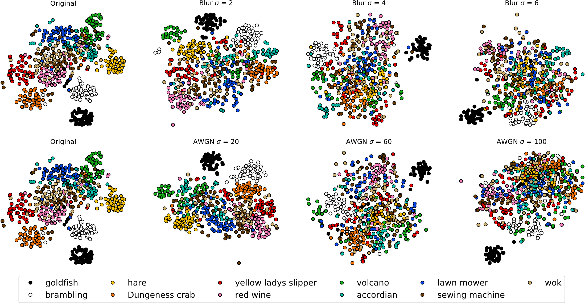
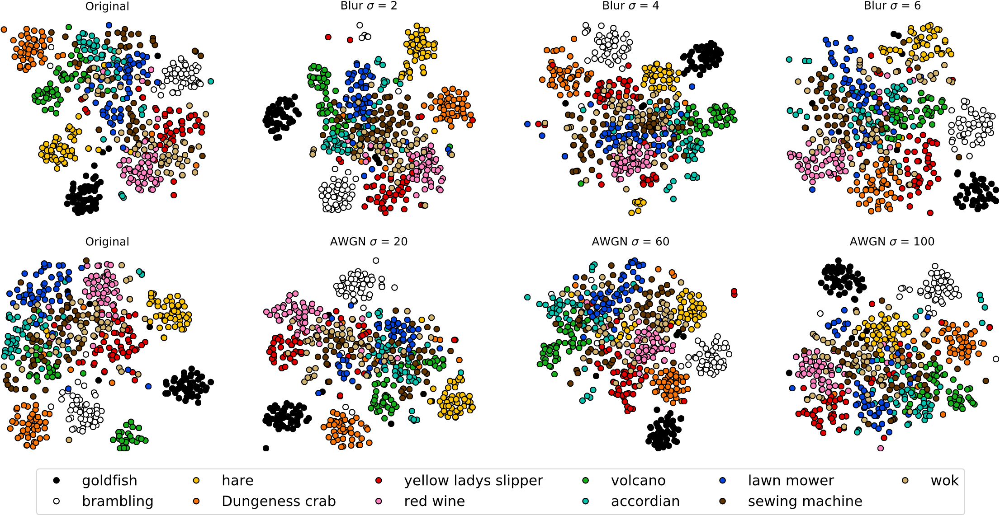

# DeepCorrect: *Correcting DNN models against Image Distortions*
Created by Tejas Borkar and Lina Karam at Arizona State University ECEE.

## Introduction
In recent years, the widespread use of deep neural networks (DNNs) has facilitated great improvements in performance for computer vision tasks like image classification and object recognition. In most realistic computer vision applications, an input image undergoes some form of image distortion such as blur and additive noise during image acquisition or transmission. Deep networks trained on pristine images perform poorly when tested on such distortions. *DeepCorrect* improves the robustness of pre-trained DNN models by training small stacks of convolutional layers with *residual* connections at the output of the most distortion susceptible convolutional filters in a DNN, to correct their filter activations, whilst leaving the rest of the pre-trained DNN filter outputs unchanged. Performance results show that applying *DeepCorrect* models for common vision tasks like image classification (ImageNet), object recognition (Caltech-101, Caltech-256) and scene classification (SUN-397), significantly improves the robustness of DNNs against distorted images and outperforms the alternative approach of network fine-tuning.

A complete description of *DeepCorrect* can be found in our journal paper [IEEE Transactions on Image Processing](https://ieeexplore.ieee.org/document/8746775) or in a pre-print on [ArXiv](https://arxiv.org/abs/1705.02406). 

   **2-dimensional t-SNE embedding of baseline AlexNet DNN features for ImageNet object classes :**
   

   


   **2-dimensional t-SNE embedding of DeepCorrect features for ImageNet object classes :**


  


 **Robust perception for quality affected images using DeepCorrect :**
   
   Convolution layers in the *DeepCorrect* models, shown in gray with dashed outlines, are nontrainable layers and their weights are kept the same as those of the baseline models trained on undistorted images. 
  


  


## Citing *DeepCorrect*
If you use *DeepCorrect* in your research, please consider citing:
```
@article{BorkarK17TIP,
  author    = {Tejas S. Borkar and Lina J. Karam},
  title     = {DeepCorrect: Correcting {DNN} models against Image Distortions},
  journal   = {IEEE Transactions on Image Processing},
  doi       = {10.1109/TIP.2019.2924172},
  pages     = {1-13},
  year      = {2019},
  issn      = {1057-7149},
}
```
```
@article{BorkarK17,
  author    = {Tejas S. Borkar and Lina J. Karam},
  title     = {DeepCorrect: Correcting {DNN} models against Image Distortions},
  journal   = {CoRR},
  volume    = {abs/1705.02406},
  year      = {2017},
  url       = {http://arxiv.org/abs/1705.02406},
  archivePrefix = {arXiv},
  eprint    = {1705.02406},
}
```
## *DeepCorrect* performance results 


### ResNet18 
#### Top-1 accuracy for ImageNet

| Model       | Gasussian Blur  | AWGN  | Motion Blur  | Defocus Blur  | Camshake Blur  |
|:--------:   |:---------------:|:-----:|:------------:|:-------------:|:--------------:|
| Baseline    |  0.3841         |0.3255 |   0.4436     |    0.3582     |     0.4749     |
| Finetuning  |  0.5617         |0.5970 |   0.6197     |    0.5615     |     0.6041     |
|*DeepCorrect*|  **0.5839**         |**0.6087** |   **0.6474**     |    **0.5831**     |     **0.6365**     | 

### AlexNet 

#### Top-1 accuracy for undistorted images

|   Model        |  ImageNet        |    SUN-397  |   Caltech-101  |  Caltech-256   | 
| :-----------:  | :--------------: | :---------: |   :----------: |   :---------:  | 
|  Baseline      |    0.5694        |   0.3100    |     0.8500     |    0.6200      | 


#### Top-1 accuracy for Gaussian blur affected images, averaged over all levels of distortion


|   Model        |  ImageNet (2012) |    SUN-397  |   Caltech-101  |  Caltech-256   |  
| :-----------:  | :--------------: | :---------: |   :----------: |   :---------:  | 
|  Baseline      |    0.2305        |   0.1393    |     0.4980     |    0.2971      |  
|  Finetuning    |    0.4596        |   0.2369    |     0.7710     |    0.5167      |  
| *DeepCorrect*  |   **0.5071**     | **0.3049**  |   **0.8371**   |   **0.5883**   | 


#### Top-1 accuracy for AWGN affected images, averaged over all levels of distortion

|   Model        |  ImageNet (2012) |    SUN-397  |   Caltech-101  |  Caltech-256   |  
| :-----------:  | :--------------: | :---------: |   :----------: |   :---------:  | 
|  Baseline      |    0.2375        |   0.0859    |     0.3423     |    0.1756      |  
|  Finetuning    |    0.4894        |   0.1617    |     0.7705     |    0.4995      |  
| *DeepCorrect*  |   **0.5092**     | **0.2936**  |   **0.8034**   |   **0.5482**   | 

### Trainable parameters 

|   Model        |    AlexNet       |  ResNet18   |
| :-----------:  | :--------------: | :---------: |
|  Finetuning    |    60.94 M       | 11.7 M  |
| *DeepCorrect*  |      2.81 M      |   5.5 M |


## Code
Due to a [patent pending for *DeepCorrect*](https://patents.google.com/patent/US20190303720A1/en), our pretrained *DeepCorrect* models will be made available for academic purposes upon request. Please email Tejas Borkar (tsborkar@asu.edu) for any questions. 
